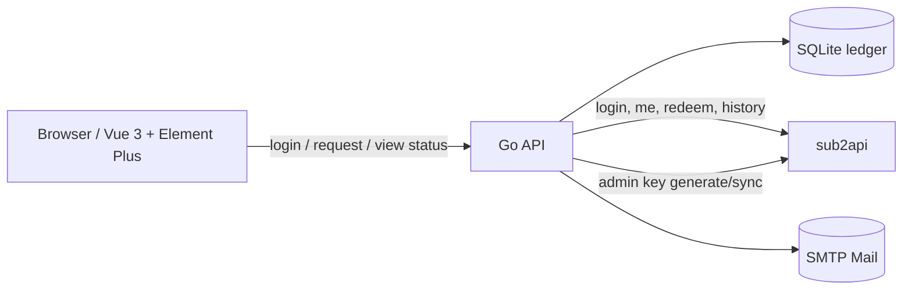

# Sub2API 兑换码系统设计

## 目标

做一个独立的前后端应用，用来承接 `sub2api` 的兑换码生成和查询能力。

核心要求：

- 前端使用 `Vue 3 + Element Plus`
- 后端使用 `Go`
- 不新建一套独立用户体系，直接对接 `sub2api` 现有用户和管理员账号
- 生成兑换码时，后端从配置文件读取 `sub2api` 管理员密钥
- 支持按用户统计申请记录，以及每个兑换码的使用状态
- 用户在申请兑换码前，必须先向管理员提交申请，管理员通过单独配置的 SMTP 邮箱点击确认后，用户才可申请一次兑换码
- 当前仅开放余额兑换码，且用户侧只允许选择管理员动态配置的余额档位，默认是 `$120` 和 `$240`

## 非目标

- 不重做 `sub2api` 的完整管理后台
- 不实现新的支付、订阅、模型转发能力
- 不替代 `sub2api` 的用户数据库，只做本地账本和界面层

## 推荐方案

采用 `Go + Gin + SQLite + Vue 3 + Element Plus`。

理由：

- `sub2api` 本身就是 Go，接口对接最顺手
- SQLite 适合单机部署和快速初始化
- 兑换码系统的数据量不大，先做轻量账本最稳
- 后续如果需要多实例，再把仓储层切到 PostgreSQL

## 系统结构

### 角色

- 用户：使用 `sub2api` 账号登录，先提交兑换资格申请，再在批准后申请一次兑换码，查看自己的申请和状态
- 管理员：使用 `sub2api` 管理员账号登录，查看全量数据、同步状态、用户汇总

### 身份原则

- 不创建本地用户注册/登录体系
- 只保存 `sub2api` 的会话快照和本地缓存
- 本地 `users` 表只做镜像，不做权威身份源

## 数据模型

### `upstream_users`

保存 `sub2api` 用户快照。

- `upstream_user_id` 主键
- `email`
- `username`
- `role`
- `status`
- `profile_json`
- `last_seen_at`
- `created_at`
- `updated_at`

### `sessions`

保存本地会话和上游 token。

- `id`
- `upstream_user_id`
- `access_token`
- `refresh_token`
- `expires_at`
- `created_at`
- `updated_at`

### `redeem_access_requests`

保存用户的兑换资格申请记录。

- `id`
- `requestor_upstream_user_id`
- `requestor_email`
- `requestor_username`
- `note`
- `status`
- `approval_token_hash`
- `approval_token_expires_at`
- `approved_at`
- `rejected_at`
- `consumed_at`
- `created_at`
- `updated_at`

状态建议：

- `pending`
- `approved`
- `rejected`
- `expired`
- `consumed`

### `redeem_requests`

保存实际兑换码申请记录（资格已批准后才可提交）。

- `id`
- `access_request_id`
- `requestor_upstream_user_id`
- `requestor_email`
- `requestor_username`
- `code_type`
- `tier_id`
- `value`
- `status`
- `note`
- `created_at`
- `updated_at`

状态建议：

- `pending`
- `issued`
- `partial_failed`
- `failed`
- `cancelled`

### `redeem_codes`

保存每一枚兑换码的本地账本。

- `id`
- `request_id`
- `code`
- `code_type`
- `value`
- `status`
- `used_by_upstream_user_id`
- `used_at`
- `expires_at`
- `sub2api_code_id`
- `created_at`
- `updated_at`
- `last_synced_at`

状态建议：

- `unused`
- `used`
- `expired`
- `disabled`

### `redeem_balance_tiers`

保存允许的余额档位，管理员可在界面动态调整。

- `id`
- `amount`
- `label`
- `enabled`
- `sort_order`
- `created_at`
- `updated_at`

### `sync_state`

保存同步游标和最近一次同步时间。

- `key`
- `value`

## 关键流程

### 登录

1. 前端提交 `sub2api` 邮箱和密码
2. 后端调用 `sub2api` 登录接口
3. 后端保存会话和用户快照
4. 前端进入对应视图

### 申请兑换码

1. 用户先提交兑换资格申请，附带备注或用途说明
2. 后端写入 `redeem_access_requests`，并通过 SMTP 把申请消息发到单独配置的管理员邮箱
3. 管理员点击邮件中的确认链接后，申请资格变为 `approved`
4. 用户在前端选择一个当前启用的余额档位，提交一次实际兑换码申请
5. 后端检查资格是否已批准且未被消费，随后使用管理员密钥调用 `sub2api` 的 `POST /api/v1/admin/redeem-codes/generate`
6. 后端写入本地 `redeem_requests` 和 `redeem_codes`，并将该资格标记为 `consumed`
7. 前端立即回显兑换码

说明：

- 默认走“生成兑换码”流程，不走 `create-and-redeem`
- `create-and-redeem` 只保留给以后需要“指定用户即时入账”的扩展场景

### 状态同步

1. 后端定时拉取 `sub2api` 管理端兑换码列表
2. 按 `code` 或 `id` 合并本地记录
3. 更新 `used/expired/used_by/used_at`
4. 前端展示同步后的最终状态

### 用户汇总

1. 以 `requestor_upstream_user_id` 聚合
2. 统计申请总数、已使用数、未使用数、过期数
3. 管理员页按用户查看

## 后端 API

### 认证

- `POST /api/auth/login`
- `POST /api/auth/logout`
- `GET /api/auth/me`

### 用户侧

- `POST /api/redeem-access-requests`
- `GET /api/redeem-access-requests`
- `GET /api/redeem-access-requests/:id`
- `GET /api/redeem-access-requests/confirm?token=...`
- `POST /api/redeem-requests`
- `GET /api/redeem-requests`
- `GET /api/redeem-requests/:id`
- `GET /api/redeem-codes`
- `GET /api/redeem-codes/:id`

`code_type` 在 MVP 中固定为 `balance`，用户侧不暴露其他类型。
`POST /api/redeem-requests` 只提交 `tier_id` 和备注，金额由当前启用档位决定。

### 管理侧

- `GET /api/admin/users`
- `GET /api/admin/users/:id/redeem-codes`
- `GET /api/admin/redeem-access-requests`
- `GET /api/admin/redeem-access-requests/:id`
- `POST /api/admin/redeem-access-requests/:id/approve`
- `POST /api/admin/redeem-access-requests/:id/reject`
- `GET /api/admin/redeem-codes`
- `POST /api/admin/sync/redeem-codes`
- `GET /api/admin/stats`
- `GET /api/admin/redeem-balance-tiers`
- `PUT /api/admin/redeem-balance-tiers`

`PUT /api/admin/redeem-balance-tiers` 以整批列表为准，管理员在界面里直接增删改启用档位。

## 前端页面

### 用户页

- 登录页
- 兑换资格申请页
- 我的兑换码
- 兑换码申请页
- 申请详情抽屉
- 状态标签和一键复制

### 管理页

- 总览统计
- 申请审批队列
- 全量兑换码表
- 用户汇总表
- 单用户详情
- 余额档位配置
- 手动同步按钮

UI 约束：

- 使用 Element Plus 原生组件
- 以表格、抽屉、弹窗、标签为主
- 不做营销页，不做装饰性大 Hero

## 配置

后端使用 `config.yaml`。

必需字段：

- `app.listen_addr`
- `app.base_url`
- `database.driver`
- `database.path`
- `sub2api.base_url`
- `sub2api.admin_api_key`
- `mail.smtp_host`
- `mail.smtp_port`
- `mail.smtp_username`
- `mail.smtp_password`
- `mail.from_address`
- `mail.admin_to_address`
- `session.cookie_secret`
- `sync.interval_seconds`

要求：

- 管理员密钥只放后端配置，不下发到前端
- 管理员审批邮箱与管理员登录账号分离，邮件仅发送到单独配置的管理员收件箱
- 上游地址和超时时间可配置
- 本地数据库默认使用 SQLite 文件

## 错误处理

- 上游登录失败：直接返回 `sub2api` 的错误信息
- 管理员密钥缺失：后端启动失败
- SMTP 发送失败：资格申请仍然入库，前端展示“待发送/发送失败”，后台可重试
- 资格未批准或已消费：实际兑换码申请直接拒绝
- 余额档位被禁用：实际兑换码申请直接拒绝
- 上游生成失败：申请记录标记为失败，已成功生成的码单独保留
- 上游同步失败：保留本地旧状态，并在界面提示“数据可能延迟”
- 代码冲突：以 `code` 唯一约束为准，避免重复入账

## 测试

后端：

- 登录代理测试
- 资格申请与邮件投递测试
- 资格确认链接一次性消费测试
- 兑换码申请测试
- 同步合并测试
- 用户汇总测试
- 管理员鉴权测试
- 余额档位管理测试

前端：

- 表单校验测试
- 申请列表渲染测试
- 状态标签和详情抽屉测试

## 假设

- `sub2api` 已部署且接口契约与参考仓库一致
- 兑换码的权威状态仍然以 `sub2api` 为准
- 本地数据库只负责缓存、统计和展示
- 每次资格批准只允许消费一次兑换码申请
- 余额档位由本地数据库维护，默认初始值为 `$120` 和 `$240`
